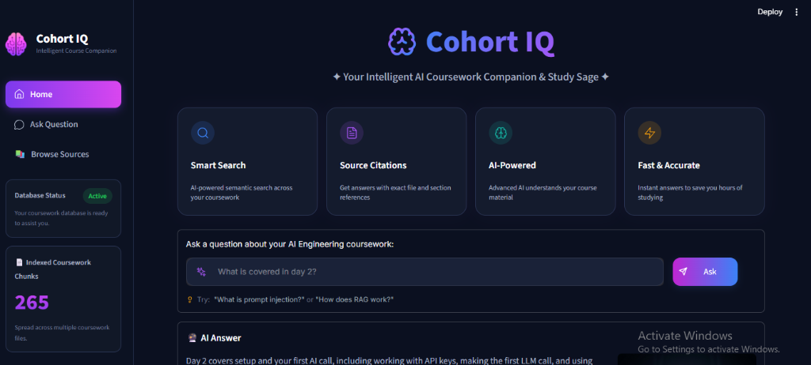
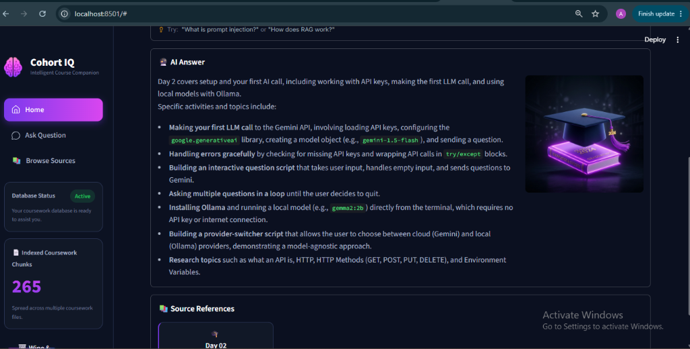
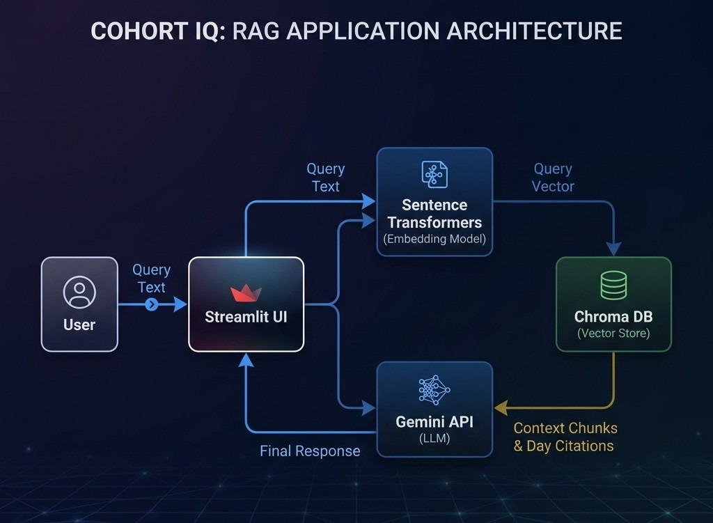

# Cohort IQ: Intelligent AI Coursework Companion & Study Sage

Cohort IQ is a Retrieval-Augmented Generation (RAG) web application that allows AI Engineering interns to ask questions and retrieve accurate, cited answers from their daily course markdown files. It indexes course materials to provide grounded, factual responses with source citations, ensuring zero hallucination.

## Status
🚧 In progress — Capstone Day 3 of 4. Interface complete and usable, not yet deployed or polished.

## Interface Screenshots





## Architecture



The app embeds incoming questions, retrieves the most relevant chunks
from a pre-indexed Chroma collection, and passes both to Gemini to
generate a grounded answer with citations.

### Data Flow
```
[User]
  ↓ types question in Streamlit UI
[Streamlit App]
  ↓ embeds question
[Sentence Transformers model] (cached, loaded once)
  ↓ query embedding
[Chroma persistent collection] (pre-indexed from markdown lesson files)
  ↓ top chunks + metadata (day number)
[Streamlit App]
  ↓ builds final prompt with context + question
[Gemini API] (system prompt: answer only from context, cite the exact day)
  ↓ answer text
[Streamlit App]
  ↓ displays answer + sources, grouped by day
```

### Indexing Pipeline (runs once, separately)
```
[Markdown lesson files] → [Chunker] → [Embedder] → [Chroma collection on disk]
```

## How It Works

1. **Document Ingestion:** Daily course lesson notes (markdown files) are chunked dynamically into semantic sections, embedded into vector representations using a SentenceTransformer model, and stored in a persistent local Chroma database.
2. **User Query & Safety Checks:** When a student enters a question, Cohort IQ instantly runs **prompt injection guardrails** and **PII detection filters** to block malicious overrides or accidental leaks of personal information (emails, credit cards, phones, etc.) before calling the pipeline.
3. **Response Caching:** If the identical question has been asked during the current session, Cohort IQ instantly serves the answer in **0.02 seconds** from its session response cache.
4. **Context Matching:** For new queries, the app converts the question to an embedding vector, performs semantic search to retrieve the top matching course content, and filters metadata by curriculum topic or specific Day numbers.
5. **Grounded Generation:** The retrieved context and question are sent to the Google Gemini 2.5 LLM with a strict system instruction. The model generates a factual answer using only the context.
6. **Citations & Leak Check:** The response is audited to detect system prompt leaks, and presented side-by-side with course citation references.

## Tech Stack

- **Python** (Core logic)
- **Streamlit** (User Interface)
- **SentenceTransformers** (Embedding extraction: `all-MiniLM-L6-v2`)
- **ChromaDB** (Persistent vector store)
- **Google Gemini 2.5 Flash** (Generative LLM)
- **python-dotenv** (Environment config)

## Setup Instructions

Tested from a clean clone:
```bash
git clone https://github.com/yourname/cohort-iq.git
cd cohort-iq
```

### 1. Configure API Keys
Create a `.env` file in the root directory:
```env
GEMINI_API_KEY=your_actual_gemini_api_key_here
```

### 2. Add Course Data
Place your course markdown files (e.g., `day01_notes.md`, `day12_safety.md`) inside the `data/` folder.

### 3. Install Dependencies
```bash
pip install -r requirements.txt
```

### 4. Run the Web App
```bash
streamlit run app.py
```
This will automatically launch the browser at `http://localhost:8501`.

## Live Demo
You can try the live application here: [cohort-iq.streamlit.app](https://cohort-iq.streamlit.app/)

## Known Limitations

- **Supported formats:** Currently only parses Markdown (`.md`) coursework files.
- **Language support:** Optimized specifically for English coursework and queries.
- **Data scope:** Confined exclusively to the loaded coursework contents. It will refuse to answer out-of-scope questions that are not present in the course notes.
